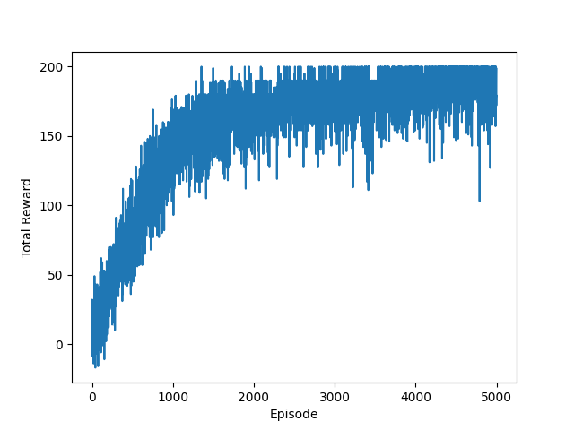
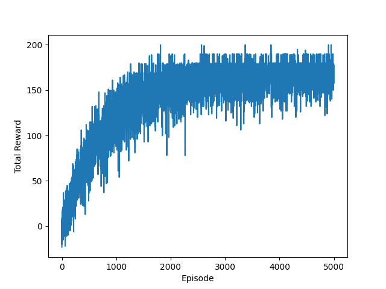
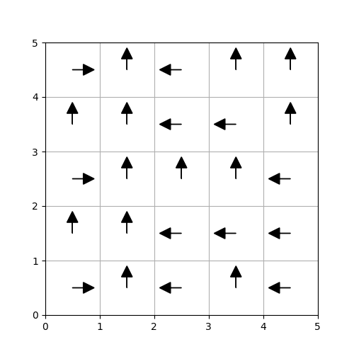

# HW3 Mike Liu xl142

## 1) Easy
### Learning Curve

### Trajectory

### Policy

## 2) Hard

### Learning Curve

### Trajectory

### Policy

## 3) REINFORCE on Continuous Pendulum with Sparse Reward

I copied the code from HW2 and modified it to have continuous state and action space.

### Implementation

As instructed, I implemented a Gaussian Policy with 1 linear layer and 1 hidden layer with 64 units for each mu and sigma head.

To handle sparse rewards, I used GAE with lambda = 0.95, and a value network.

### Learning Curve

### Trajectory

### Video

figures/test_pendulum.gif

